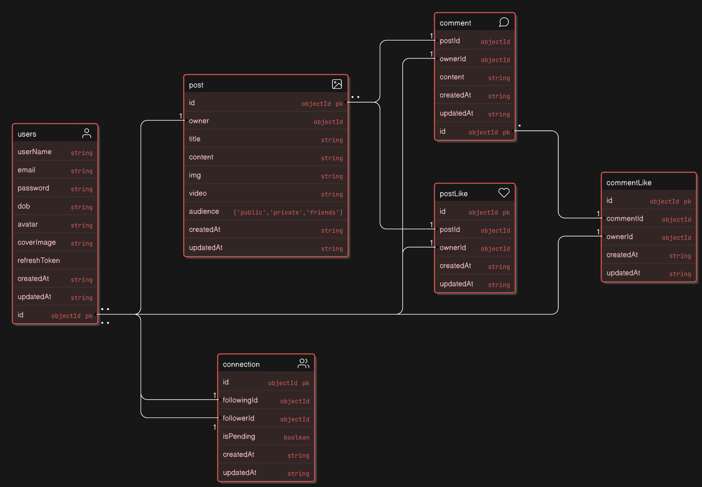

## Built with 

## FrontEnd of this Project 
This is BackEnd of the project . For FrontEnd Code -
<pre>
Please Visit - <a href="https://github.com/Saibalweb/Friendly" target="_blank">Friendly</a>
</pre>

## About this Project 

**Friendly** is a feature-rich social media app developed using React Native, with Express.js and MongoDB powering the backend. The app provides users with a platform to connect with friends, share their thoughts through posts, and interact with the community by commenting on others' posts. Friendly emphasizes user engagement and fosters meaningful connections, making it easy to stay connected and express oneself in a dynamic and interactive environment. With its user-friendly interface and responsive design, the app delivers a seamless experience across devices

## Data Model 
The data model for this application is as follows:

## Project Structure 
The folder structure of this app is explained below:

| Name | Description |
| ------------------------ | --------------------------------------------------------------------------------------------- |
| **node_modules**         | Contains all  npm dependencies  |
| **src**                  | Contains  source code |
| **src/controllers**      | Controllers define functions to serve various express routes. |
| **src/db**               | Contain Database connection  |
| **src/middlewares**      | Express middlewares which process the incoming requests before handling them down to the |
| **src/models**            | Models define schemas that will be used in storing and retrieving data from Application. |
| **src/routes**           | Contain all express routes, separated by module/area of application|     
| **src/utils**            | Common libraries to be used across your app.  |
| **src**/index.js         | Entry point to express app | 
| **src**/app.js           | Contains Basic configuration like cors ,bodyParser | 
| package.json             | Contains npm dependencies   | 

## Environment vars 

The following environment variables are required:

| Name                         | Description                         |  Example Value                               |
| -----------------------------| ------------------------------------| -----------------------------------------------|
|CORS                          | Cors accepted values                  | "*"      |
|PORT                          | The port on which the server will run| 3000      |
|MONGODB_URI                   | Your MongoDb Uri                     |       |
|AccessToken Secret            | Your Unique random AccessToken secret to generate accessToken          |       |
|RefreshToken Secret           | Your Unique random RefreshToken secret to generate RefreshToken       |       |
|AccessToken Expiry            | Duration for accessToken validaty          |     10m,1h,1d  |
|RefreshToken Expiry           | Duration for RefreshToken validaty    |    10m,1h,1d,10d   |
|Cloudinary CloudName          | Your Cloudinary CloudName          |       |
|Cloudinary ApiKey              | Your Cloudinary ApiKey              |       |
|Cloudinary ApiSecret           | Your Cloudinary ApiSecret           |       |

## Api Reference 

Before looking at the apis take a look of how a user authorized using **accessToken** which is generated using jwt 

### Authentication
-----
Many of Api routes are completely secured . It needs secured token like **accessToken** or **refreshToken** to get data. 
To generate accessToken or refreshToken you generally need to **register** and **login** in this app

to authenticate you need to send token in in **header** in your request like this-

<pre>
Authorization: Bearer your_access_token
</pre>

Now look all of the routes implemented in this server 

### User Routes
------------------
In this follwoing table there are all user routes available with those any user can register , login , change Password ,refresh accessToken, upload avatar and cover Image .
  All of this user routes stars with 
> **/api/v1/users**

| EndPoints           | Methods | Descriptions                   |
|---------------------|---------|--------------------------------|
| `/register `          | POST    | register a user                | 
| `/login `             | POST    | login the user                 |
| `/logout `            | POST    | for user logout                |
| `/change-password`    | POST    | change user password           |
| `/get-user `          | GET     |  For getting the user details  | 
| `/refresh-token`      | POST    | for refreshing the accessToken |
| `/update-avatar`      | POST    | for updating  user avatar      |
| `/update-coverImage` | POST    | for updating  user coverImage  |

### Post Routes 
---------------------
In this follwoing table there are all post routes available with those any user can create , update ,delete ,get posts
  All of this post routes starts with
> **/api/v1/post**

 **note** all of this routes are secured routes 

| Endpoints                | Methods | Description                                      |
|--------------------------|---------|--------------------------------------------------|
| `/:id/all-posts`         | GET     | Retrieve all posts for a specific user.          |
| `/:id`                   | GET     | Retrieve paginated posts for a specific user.    |
| `/post-id/:id`           | GET     | Retrieve a post by its unique ID.                |
| `/upload`                | POST    | Upload an image (max 2) or video (max 1) for a post. |
| `/update/:id`            | PATCH   | Update an existing post by its ID.               |
| `/delete/:id`            | DELETE  | Delete a specific post by its ID.                |

### Comment Routes 
--------------------
In this follwoing table there are all comment routes available with those any user can create , update ,delete , get comments 
  All of this comment routes starts with
> **/api/v1/comment**

**note** all of this routes are secured routes 

| Endpoints                    | Methods | Description                                       |
|------------------------------|---------|---------------------------------------------------|
| `/upload`                    | POST    | Upload a new comment.                            |
| `/update/:id`                | PATCH   | Update an existing comment by its ID.            |
| `/delete/:id`                | DELETE  | Delete a specific comment by its ID.             |
| `/:postId/all-comments`      | GET     | Retrieve all comments for a specific post.       |

### Connection Routes 
----------------------
In this follwoing table there are all connection routes available with those any user can follow , unfollow , get followers and following
  All of this connection routes starts with
> **/api/v1/connection**

**note** all of this routes are secured routes 

| Endpoints                 | Methods | Description                                   |
|---------------------------|---------|-----------------------------------------------|
| `/follow/:id`             | POST    | Follow a user by their ID.                    |
| `/unfollow/:id`           | DELETE  | Unfollow a user by their ID.                  |
| `/get-followings/:id`     | GET     | Retrieve a list of users that the user is following. |
| `/get-followers/:id`      | GET     | Retrieve a list of users who are following the user. |

### PostLike Routes 
---------------------
In this follwoing table there are all post like routes available with those any user can like , remove like of a post 
  All of this post like routes starts with
> **/api/v1/like/post**

**note** all of this routes are secured routes

| Endpoints                  | Methods | Description                                  |
|----------------------------|---------|----------------------------------------------|
| `/:postId/add-like`        | POST    | Add a like to a specific post by its ID.     |
| `/:postId/remove-like`     | DELETE  | Remove a like from a specific post by its ID. |

